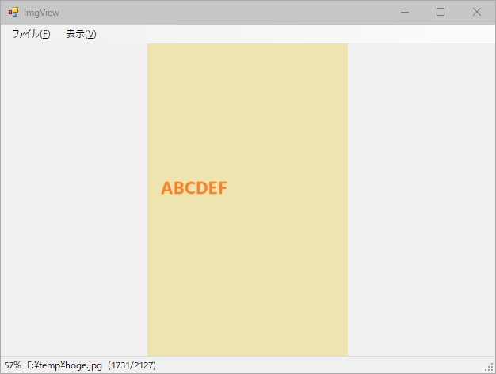

# name

imgview

## Overview

a simple photo viewer

## Requirement

- Windows

- .NET framework (v4.7.2)

- Microsoft Visual Studio 2019

## Usage

- Supported formats: BMP/GIF/JPEG/PNG/TIFF/ICON

- Open image file(s) specified in command line arguments, usually by setting up file associations.

- Press left/right arrow keys to display image files in the same directory.

## Description

When opening from Explorer window, enumerate the image files by the order same as that Explorer.

## Screenshot

## Author

Orion78cvz (Okinawa Bunmei)

## Licence

This project is licensed under the terms of the MIT license.
